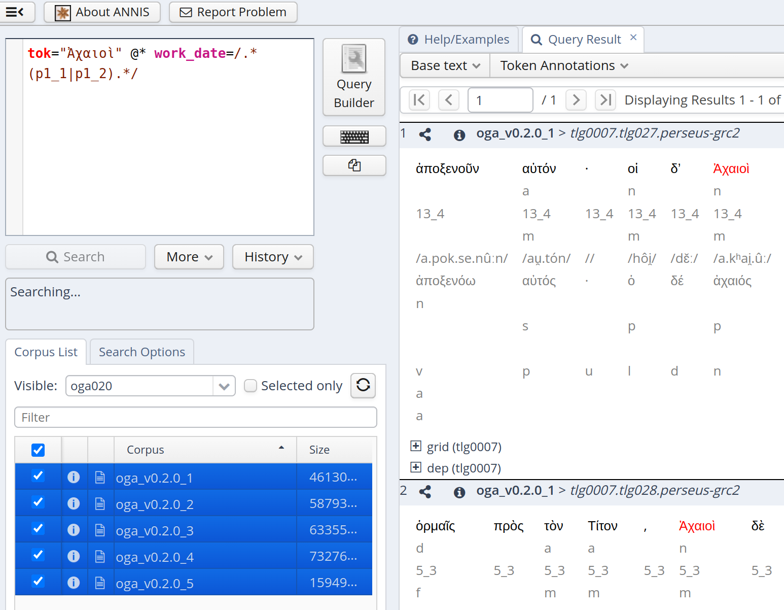

# Query the Corpus

The annotations in OGA can be queried using the original PAULA XML files 
or ANNIS 4. 
In either case, one must know the labels used to encode annotations
(for example, `v` stands for verbs and `n` for nouns). The files in this
folder document the admissible keys and values.

## ANNIS 4

Annis query language is documented 
on https://korpling.github.io/ANNIS/4/user-guide/aql/index.html. 
What is important to undestand for querying in ANNIS 4
is that there are two
kinds of annotation that two kinds of syntax correspond to: 
the annotation associated with single tokens (*token-based*) and 
the annotation associated with all tokens of a text (*text-based*, 
known also as metadata field). For example, the field `author`
is the same for all tokens of a text and therefore is a metadata field. 

In ANNIS 4, annotations associated with single tokens (token-based) are simply
searched using key/value pairs, such as `token="ἀθηναῖος"` or 
`lemma="ἀθηναῖος"`. Metadata fields are also accessed through key/value pairs, 
but are introduced by the operator `@*` (e.g., `@* urn_cts_author="tlg0010"`).
For more clarification, [query examples](#annis-query-examples) are provided below as templates.

The following table lists all possible search keys and their values:

|type of annotation|syntax|comment/values|
|-----|-----|-----|
|token-based|`token="Ἀθηναῖος"`|this is a word form (UTF-8, NFC-normalized)|
|token-based|`lemma="ἀθηναῖος"`|lemmas (UTF-8, NFC-normalized) are lowercased in OGA v0.2.0|
|token-based|`pos="v"`|part of speech; see <a href="./morphology.md">values</a>|
|token-based|`person="2"`|morphological feature; see <a href="./morphology.md">values</a>|
|token-based|`number="s"`|morphological feature; see <a href="./morphology.md">values</a>|
|token-based|`tense="p"`|morphological feature; see <a href="./morphology.md">values</a>|
|token-based|`mood="i"`|morphological feature; see <a href="./morphology.md">values</a>|
|token-based|`voice="a"`|morphological feature; see <a href="./morphology.md">values</a>|
|token-based|`gender="m"`|morphological feature; see <a href="./morphology.md">values</a>|
|token-based|`case="n"`|morphological feature; see <a href="./morphology.md">values</a>|
|token-based|`degree="m"`|morphological feature; see <a href="./morphology.md">values</a>|
|token-based|`cts="1_2"`|CTS structure for passage; see <a href="./cts_work_date.md#cts-urn">values</a>|
|token-based|`ipa01="/an.drá.si/"`| experimental IPA transcription (5th BCE Attic pronunciation); see examples from Wiktionary, such as <a href="https://en.wiktionary.org/wiki/%E1%BC%84%CE%BE%CE%B9%CE%BF%CE%B9#Ancient_Greek">ἄξιοι</a>| 
|text-based|`@* urn_cts="tlg0010.tlg001.perseus-grc2"`| this identifies an author, work and edition; see <a href="./cts_work_date.md">values</a>|
|text-based|`@* urn_cts_author="tlg0010"`| this identifies an author; see <a href="./cts_work_date.md">values</a>|
|text-based|`@* urn_cts_work="tlg001"`| this identifies a work; see <a href="./cts_work_date.md">values</a>|
|text-based|`@* urn_cts_edition="perseus-grc2"`| this identifies an edition; see <a href="./cts_work_date.md">values</a>|
|text-based|`@* author="Isocrates"`| this identifies an author; see <a href="./cts_work_date.md">values</a>|
|text-based|`@* title="Against Euthynus"`| this identifies a work; see <a href="./cts_work_date.md">values</a>|
|text-based|`@* work_date="m1_2"`| alleged work composition; for its logic, see <a href="./cts_work_date.md#work-dates">values</a>|

## ANNIS Query Examples

The following are query examples that can be used as templates:

<table>
  <thead>
    <tr>
      <th>Query</th>
      <th>Explanation</th>
    </tr>
  </thead>
  <tbody>
<tr>
<td><a href="https://annis.varro.informatik.uni-leipzig.de/?id=b30de80b-7d53-41d4-8304-487bf01dffa7#_q=dG9rPSLhvIjPh86xzrnOv-G9tiIgQCogd29ya19kYXRlPS8uKihwMV8xfHAxXzIpLiov&ql=aql&_c=b2dhX3YwLjIuMF81LG9nYV92MC4yLjBfMyxvZ2FfdjAuMi4wXzQsb2dhX3YwLjIuMF8xLG9nYV92MC4yLjBfMg&cl=5&cr=5&s=0&l=10&">tok="Ἀχαιοὶ" @* work_date=/.*(p1_1|p1_2).*/</a></td>
<td>Search for the word form <code>Ἀχαιοὶ</code> in all texts written in the 1st and 2nd half of the 1st century CE (note that a value included in // is a <a href="https://korpling.github.io/ANNIS/4/user-guide/aql/regex.html">regular expression</a>)</td>
</tr>

<tr>
<td><a href="https://annis.varro.informatik.uni-leipzig.de/?id=d70ea7e5-fcbd-42fc-9c76-6c2eb45c0c40#_q=cG9zPSJ2IiBfaWRlbnRfIGN0cz0vM18uKi8gQCogYXV0aG9yPSJIb21lciIgX2lkZW50XyB0aXRsZT0iSWxpYWQiCg&ql=aql&_c=b2dhX3YwLjIuMF81LG9nYV92MC4yLjBfMyxvZ2FfdjAuMi4wXzQsb2dhX3YwLjIuMF8xLG9nYV92MC4yLjBfMg&cl=5&cr=5&s=0&l=10&">pos="v" _ident_ cts=/3_.*/ @* author="Homer" _ident_ title="Iliad"</a></td>
<td>Find all verbs in the 3th Book of Homer's Iliad. Note that <code>_ident_</code> is
used because the keys apply to the same token</td>
</tr>

<tr>
<td><a href="https://annis.varro.informatik.uni-leipzig.de/?id=71be1461-8388-4f80-b602-3e1f4e914678#_q=bGVtbWE9Is-Hz4HPjM69zr_PgiIgQCogYXV0aG9yPS8oTmV3IFRlc3RhbWVudHxTZXB0dWFnaW50YSkv&ql=aql&_c=b2dhX3YwLjIuMF81LG9nYV92MC4yLjBfMyxvZ2FfdjAuMi4wXzQsb2dhX3YwLjIuMF8xLG9nYV92MC4yLjBfMg&cl=5&cr=5&s=0&l=10&">lemma="χρόνος" @* author=/(New Testament|Septuaginta)/</a></td>
<td>Search for the lemma <code>χρόνος</code> in the New Testament and Septuaginta</td>
</tr>

<tr>
<td><a href="https://annis.varro.informatik.uni-leipzig.de/?id=6f569a32-aa01-4d81-b3f9-72787aa13b07#_q=bGVtbWE9Is-Hz4HPjM69zr_PgiIgQCogYXV0aG9yPSJCaWJsZSI&ql=aql&_c=b2dhX3YwLjIuMF81LG9nYV92MC4yLjBfMyxvZ2FfdjAuMi4wXzQsb2dhX3YwLjIuMF8xLG9nYV92MC4yLjBfMg&cl=5&cr=5&s=0&l=10&">lemma="χρόνος" @* author="Bible"</a></td>
<td>Same as above, but the Bible texts come from a different edition (check full metadata for a text <a href="../urn_cts/texts/urn_cts_plus_date_label.xml">here</a>)</td>
</tr>

<tr>
<td><a href="https://annis.varro.informatik.uni-leipzig.de/?id=6ac1b972-334f-445d-be0c-19dabb8f38fb#_q=cG9zPSJ2IiBfaWRlbnRfIG1vb2Q9ImkiIC0-ZGVwW2RlcF9mbmM9Ik9CSiJdIHBvcz0ibiIgJiAjMyAuMSwzICMyIEAqIHdvcmtfZGF0ZT0vLioobTFfMXxtMV8yKS4qLwo&ql=aql&_c=b2dhX3YwLjIuMF81LG9nYV92MC4yLjBfMyxvZ2FfdjAuMi4wXzQsb2dhX3YwLjIuMF8xLG9nYV92MC4yLjBfMg&cl=5&cr=5&s=0&l=10&">pos="v" _ident_ mood="i" ->dep[dep_fnc="OBJ"] pos="n" & #3 .1,3 #2 @* work_date=/.*(m1_1|m1_2).*/</a></td>
<td>Search for a verb in the indicative mood that governs a noun that bears the OBJ syntactic function, and the noun is before the verb within the range of 3 tokens,
and they belong to a work composed in
the 1st or 2nd half of the fist century BCE.
Note that <code>#3</code> refers to <code>pos="n"</code> and
<code>#2</code> to <code>mood="i"</code>. <code>/.*(m1_1|m1_2).*/</code> is a <a href="https://korpling.github.io/ANNIS/4/user-guide/aql/regex.html">regular expression</a></td>
</tr>
</tbody>
</table>

## ANNIS Interface

In the ANNIS interface, OGA appears divided into 5 subcorpora for performance reasons.
All of them should be selected to query the whole corpus. After clicking on
the "Search" button, the "Searching..." message appears, as shown in the
picture below: it usually disappear in fractions of second/a few seconds, 
but depending on the complexity of the query,
it could sometimes last for many seconds/minutes (especially if regular expressions are used).
During the search time, users cannot further interact with Annis and should wait
until the results are returned.

